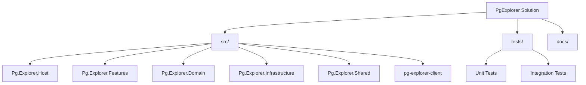
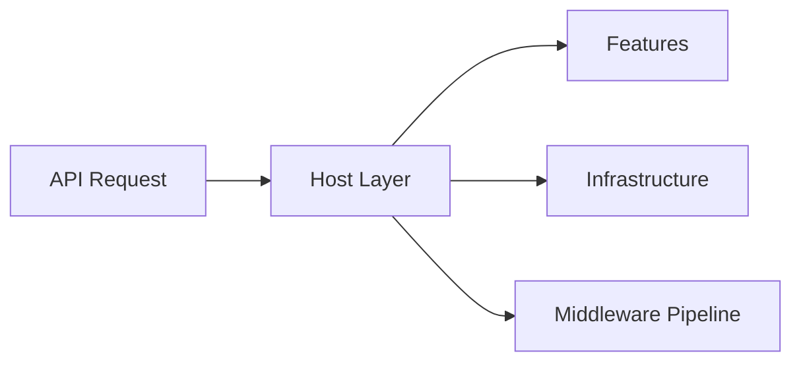
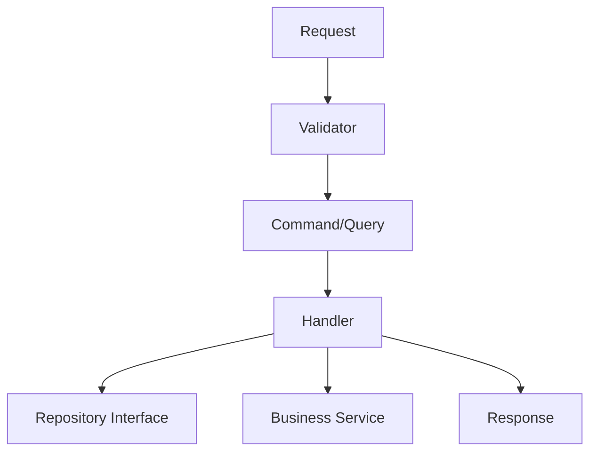
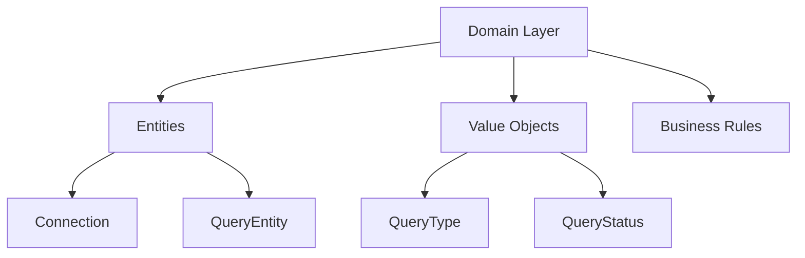
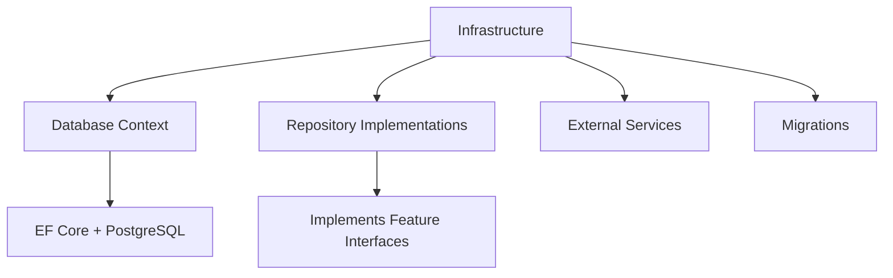
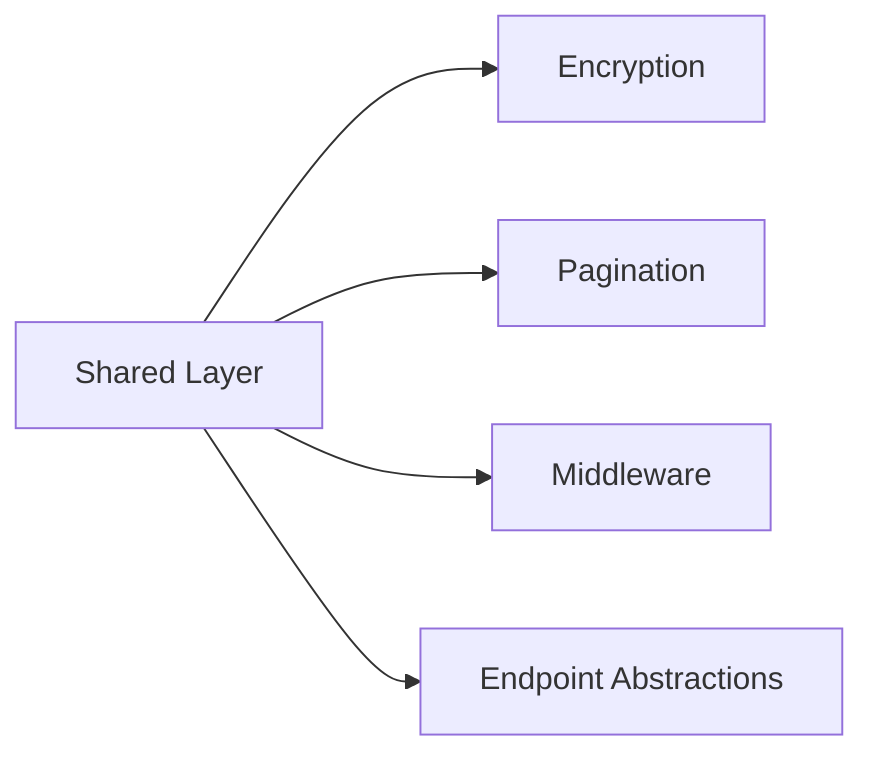
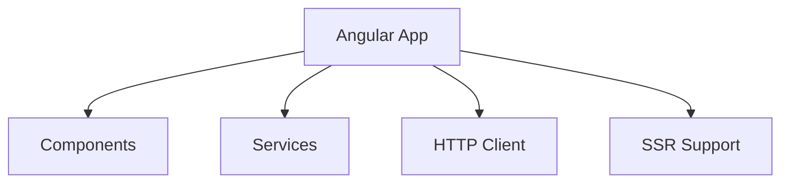
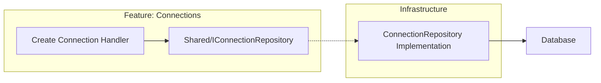
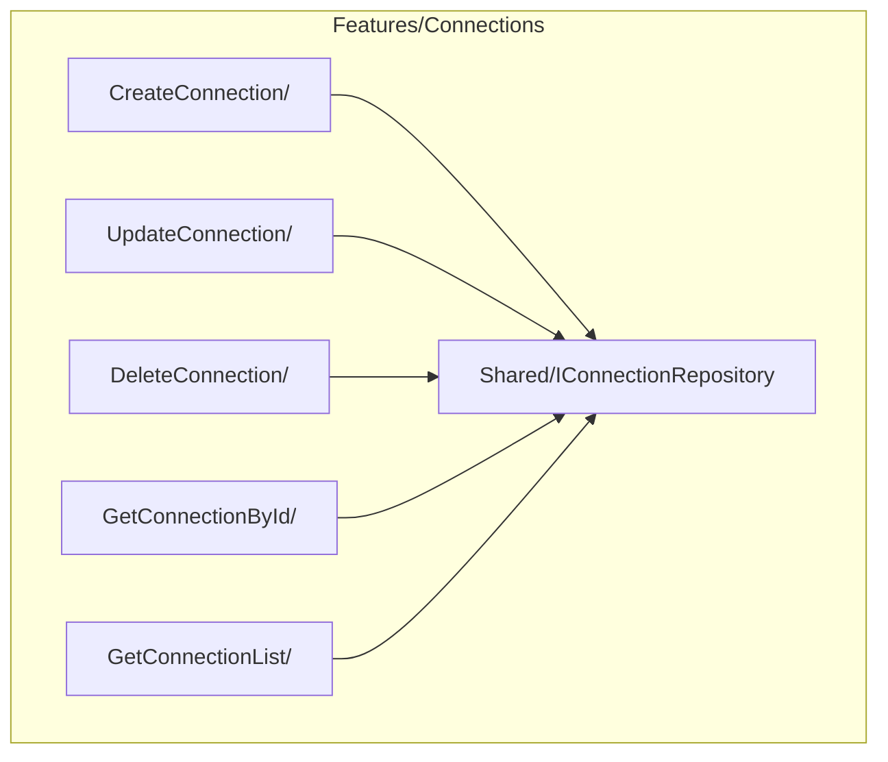
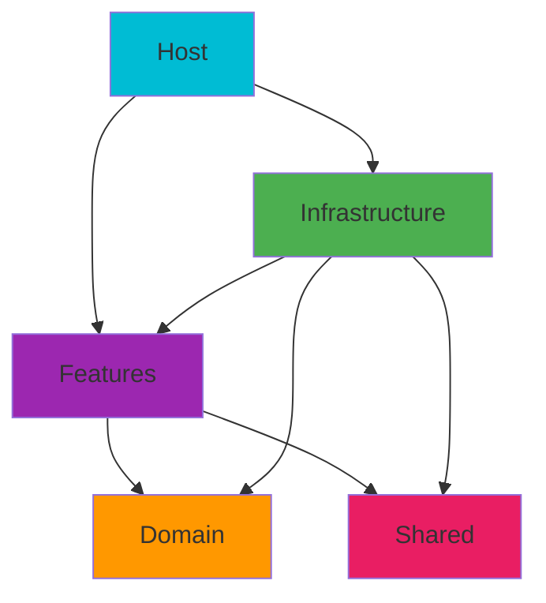

# PgExplorer Architecture Documentation

## Overview

PgExplorer uses **Clean Architecture** with **Vertical Slice Architecture** principles, creating a maintainable and scalable .NET application with Angular frontend.

> **Inspiration**: Based on [The Best Way to Structure Your .NET Projects](https://antondevtips.com/blog/the-best-way-to-structure-your-dotnet-projects-with-clean-architecture-and-vertical-slices) by Anton DevTips.

## Project Structure



## Architecture Layers

### 1. Host Layer (Entry Point)
**Project**: `Pg.Explorer.Host`



**Responsibilities:**
- Application startup & configuration
- Dependency injection setup
- API documentation (Swagger)
- Request/response handling

### 2. Features Layer (Business Logic)
**Project**: `Pg.Explorer.Features`



**Each feature contains:**
- Commands/Queries with MediatR
- Validators with FluentValidation
- API Endpoints
- Repository interfaces (in Shared folder)
- Mappings and services

### 3. Domain Layer (Pure Business)
**Project**: `Pg.Explorer.Domain`



**Zero external dependencies** - pure business logic only.

### 4. Infrastructure Layer (Data & External Services)
**Project**: `Pg.Explorer.Infrastructure`



### 5. Shared Layer (Utilities)
**Project**: `Pg.Explorer.Shared`



### 6. Frontend Layer (Angular)
**Project**: `pg-explorer-client`



## Key Innovation: Feature-Driven Repository Pattern

Traditional approach puts repository interfaces in Domain. We put them **inside each feature**:



**Benefits:**
- Complete feature encapsulation
- Repository interfaces co-located with usage
- Better cohesion, easier refactoring

## Feature Structure Example



## Dependency Flow



**Key Rules:**
- Dependencies point inward
- Domain has ZERO external dependencies
- Features define their own data contracts
- Infrastructure implements feature interfaces

## Technology Stack

### Backend
- **.NET 8** - Framework
- **ASP.NET Core** - Web API
- **Entity Framework Core** - ORM
- **PostgreSQL** - Database
- **MediatR** - CQRS pattern
- **FluentValidation** - Input validation

### Frontend
- **Angular 17+** - SPA framework
- **TypeScript** - Type safety
- **Angular Universal** - SSR
- **Docker** - Containerization

## Adding a New Feature

1. **Create feature folder** in `Pg.Explorer.Features`
2. **Define repository interface** in `FeatureName/Shared/`
3. **Create request/response models**
4. **Implement handler** with business logic
5. **Add validation** rules
6. **Create API endpoint**
7. **Implement repository** in Infrastructure

### Example Code Structure

```csharp
// Features/NewFeature/Shared/INewFeatureRepository.cs
public interface INewFeatureRepository : IRepository<Entity, Guid>
{
    Task<Entity> GetByNameAsync(string name);
}

// Features/NewFeature/Create/CreateFeatureCommand.cs
public record CreateFeatureCommand(string Name) : IRequest<ErrorOr<FeatureResponse>>;

// Features/NewFeature/Create/CreateFeatureHandler.cs
public class CreateFeatureHandler : IRequestHandler<CreateFeatureCommand, ErrorOr<FeatureResponse>>
{
    private readonly INewFeatureRepository _repository;
    // Implementation
}

// Infrastructure/Repositories/NewFeatureRepository.cs
public class NewFeatureRepository : BaseRepository<Entity, Guid>, INewFeatureRepository
{
    // Implementation
}
```

## Architecture Benefits

### ✅ Developer Benefits
- **Clear structure** - easy to find code
- **Fast development** - everything co-located
- **Easy testing** - isolated components
- **Independent features** - parallel development

### ✅ Business Benefits
- **Maintainable** - localized changes
- **Flexible** - easy to extend
- **Reliable** - separation of concerns
- **Cost-effective** - faster development

## Key Architectural Principles

1. **Feature Ownership** - Each feature owns its complete contract
2. **Pure Domain** - Zero external dependencies
3. **Vertical Slices** - High cohesion within features
4. **Clean Dependencies** - Dependencies point inward
5. **Testability** - Easy to test in isolation

This architecture provides the perfect balance between structure and flexibility, making PgExplorer maintainable and scalable.
