# PgExplorer Architecture Documentation

## Overview

PgExplorer follows a **Clean Architecture** pattern enhanced with **Vertical Slice Architecture** principles, inspired
by modern .NET best practices. This architectural approach promotes high cohesion within features while maintaining low
coupling between different parts of the system.

> **Inspiration**: This architecture was inspired by the excellent blog
> post: [The Best Way to Structure Your .NET Projects with Clean Architecture and Vertical Slices](https://antondevtips.com/blog/the-best-way-to-structure-your-dotnet-projects-with-clean-architecture-and-vertical-slices)
> by Anton DevTips.

Our architecture consists of **seven distinct layers** with a unique **Feature-Driven Repository Pattern** that enhances
traditional Clean Architecture:

## Complete Project Structure

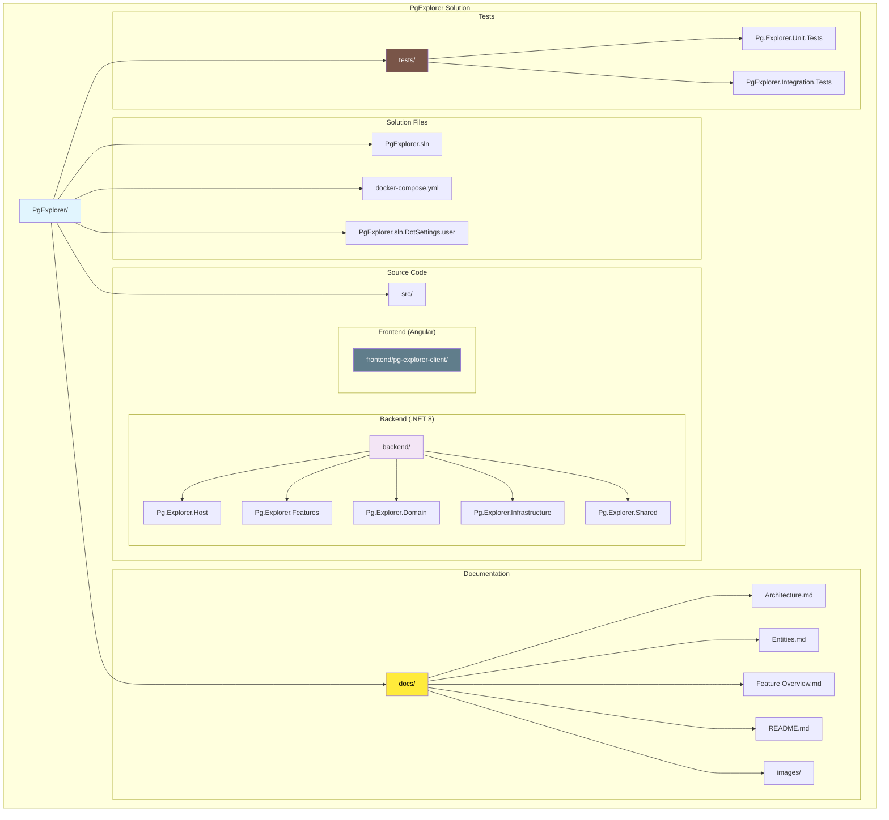

## Architecture Layers

### 1. Host Layer (Presentation)

**Project**: `Pg.Explorer.Host`
**Purpose**: The entry point and presentation layer of our application

The Host layer is responsible for:

- Application startup and configuration
- Dependency injection setup
- Middleware pipeline configuration
- API documentation (Swagger/OpenAPI)
- Request/response serialization settings

```csharp
// Key responsibilities in Program.cs
builder.Services.AddInfrastructure(builder.Configuration);
builder.Services.AddUtilities();
builder.Services.AddFeatures();
```

**Host Layer Structure**:

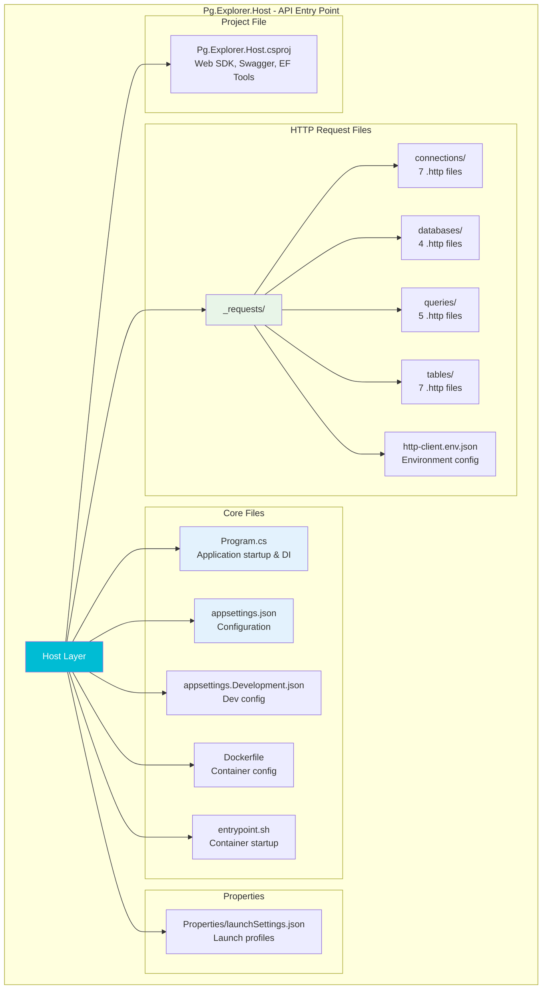

### 2. Features Layer (Application Logic)

**Project**: `Pg.Explorer.Features`
**Purpose**: Contains all business features organized as vertical slices with **embedded repository interfaces**

This is the heart of our vertical slice architecture. Each feature is completely self-contained with:

- **Command/Query Models**: Define the contracts for operations
- **Handlers**: Implement the business logic using MediatR
- **Validators**: Ensure data integrity using FluentValidation
- **Endpoints**: Expose features via REST API endpoints
- **Mappings**: Handle object transformations
- **Repository Interfaces**: Define data access contracts within each feature's Shared folder
- **Feature Services**: Business logic services specific to each feature

**Features Layer Structure**:

```mermaid
graph TD
    subgraph "Pg.Explorer.Features - Vertical Slices"
        FEATURES[Features Layer]
        
        subgraph "Core Files"
            DI[DependencyInjection.cs<br/>MediatR, FluentValidation, Endpoints]
            IREPO[IRepository.cs<br/>Base repository interface]
            FEATPROJ[Pg.Explorer.Features.csproj<br/>MediatR, FluentValidation, EF Core]
        end
        
        subgraph "Connections Feature"
            CONN[Connections/]
            
            subgraph "CreateConnection Slice"
                CREATE[CreateConnection/]
                CREATE --> CREATEC[CreateConnection.cs<br/>Command, Handler, Endpoint]
                CREATE --> CREATEM[CreateConnection.Mapping.cs<br/>Object mappings]
                CREATE --> CREATEV[CreateConnection.Validators.cs<br/>FluentValidation rules]
            end
            
            subgraph "UpdateConnection Slice"
                UPDATE[UpdateConnection/]
                UPDATE --> UPDATEC[UpdateConnection.cs<br/>Command, Handler, Endpoint]
                UPDATE --> UPDATEM[UpdateConnection.Mapping.cs<br/>Object mappings]
                UPDATE --> UPDATEV[UpdateConnection.Validators.cs<br/>FluentValidation rules]
            end
            
            subgraph "Other Connection Slices"
                DELETE[DeleteConnection/DeleteConnection.cs]
                GETBYID[GetConnectionById/GetConnectionById.cs]
                GETLIST[GetConnectionList/GetConnectionList.cs]
                GETQUERIES[GetConnectionQueries/GetConnectionQueries.cs]
                TEST[TestConnection/TestConnection.cs]
            end
            
            subgraph "Connections Shared"
                CONNSHARED[Shared/]
                CONNSHARED --> CONNMAPPING[ConnectionMapping.cs<br/>Response mappings]
                CONNSHARED --> CONNRESP[ConnectionResponse.cs<br/>Response models]
                CONNSHARED --> ICONNREPO[IConnectionRepository.cs<br/>Repository interface]
                CONNSHARED --> ICONNSERV[IConnectionService.cs<br/>Service interface]
            end
        end
        
        subgraph "Queries Feature"
            QUERIES[Queries/]
            
            subgraph "Query Slices"
                QCREATE[CreateQuery/<br/>CreateQuery.cs, .Mapping.cs, .Validators.cs]
                QUPDATE[UpdateQuery/<br/>UpdateQuery.cs, .Mapping.cs, .Validators.cs]
                QDELETE[DeleteQuery/DeleteQuery.cs]
                QGETBYID[GetQueryById/GetQueryByIdQuery.cs]
                QGETLIST[GetQueryList/GetQueryList.cs]
            end
            
            subgraph "Queries Shared"
                QSHARED[Shared/]
                QSHARED --> QREPO[IQueryEntityRepository.cs<br/>Repository interface]
                QSHARED --> QSERV[IQueryService.cs<br/>Service interface]
                QSHARED --> QMAPPING[QueryMapping.cs<br/>Response mappings]
                QSHARED --> QRESP[QueryResponse.cs<br/>Response models]
            end
        end
        
        subgraph "Tables Feature"
            TABLES[Tables/]
            
            subgraph "Table Slices"
                TGETDATA[GetTableData/<br/>GetTableData.cs, .Mapping.cs, .Validator.cs]
                TINSERT[InsertRow/<br/>InsertRow.cs, .Mappings.cs, .Validator.cs]
                TUPDATE[UpdateRow/<br/>UpdateRow.cs, .Mapping.cs, .Validator.cs]
                TDELETE[DeleteRow/<br/>DeleteRow.cs, .Mapping.cs, .Validator.cs]
                TEXPORT[ExportTable/<br/>ExportTable.cs, .Mapping.cs, .Validator.cs]
            end
            
            subgraph "Tables Shared"
                TSHARED[Shared/]
                TSHARED --> TCOL[ColumnInfo.cs<br/>Column data model]
                TSHARED --> TEXEC[ExecutionResult.cs<br/>Query execution result]
                TSHARED --> TINDEX[IndexInfo.cs<br/>Index information]
                TSHARED --> TSERV[ITableService.cs<br/>Service interface]
                TSHARED --> TINFO[TableInfo.cs<br/>Table information]
            end
        end
        
        subgraph "Databases Feature"
            DATABASES[Databases/]
            
            subgraph "Database Slices"
                DCREATE[CreateDatabase/<br/>CreateDatabase.cs, .Validator.cs]
                DDROP[DropDatabase/DropDatabase.cs]
                DGETLIST[GetDatabaseList/GetDatabaseList.cs]
                DGETSCHEMAS[GetDatabaseSchemaList/GetDatabaseSchemaList.cs]
                DGETTABLEINFO[GetTableInfoBySchemaName/GetTableInfo.cs]
                DGETTABLELIST[GetTableListBySchemaName/GetTableListBySchemaName.cs]
            end
            
            subgraph "Databases Shared"
                DSHARED[Shared/]
                DSHARED --> DINFO[DatabaseInfo.cs<br/>Database information]
                DSHARED --> DSERV[IDatabaseService.cs<br/>Service interface]
                DSHARED --> DSCHEMA[SchemaInfo.cs<br/>Schema information]
            end
        end
    end
    
    FEATURES --> DI
    FEATURES --> IREPO
    FEATURES --> FEATPROJ
    FEATURES --> CONN
    FEATURES --> QUERIES
    FEATURES --> TABLES
    FEATURES --> DATABASES
    
    CONN --> CREATE
    CONN --> UPDATE
    CONN --> DELETE
    CONN --> GETBYID
    CONN --> GETLIST
    CONN --> GETQUERIES
    CONN --> TEST
    CONN --> CONNSHARED
    
    QUERIES --> QCREATE
    QUERIES --> QUPDATE
    QUERIES --> QDELETE
    QUERIES --> QGETBYID
    QUERIES --> QGETLIST
    QUERIES --> QSHARED
    
    TABLES --> TGETDATA
    TABLES --> TINSERT
    TABLES --> TUPDATE
    TABLES --> TDELETE
    TABLES --> TEXPORT
    TABLES --> TSHARED
    
    DATABASES --> DCREATE
    DATABASES --> DDROP
    DATABASES --> DGETLIST
    DATABASES --> DGETSCHEMAS
    DATABASES --> DGETTABLEINFO
    DATABASES --> DGETTABLELIST
    DATABASES --> DSHARED
    
    style FEATURES fill:#9c27b0,color:#fff
    style CONN fill:#e1bee7
    style QUERIES fill:#e1bee7
    style TABLES fill:#e1bee7
    style DATABASES fill:#e1bee7
```

### 3. Domain Layer (Pure Business Logic)

**Project**: `Pg.Explorer.Domain`
**Purpose**: Contains the core business entities and domain logic

The Domain layer is the **purest** layer in our architecture and includes:

- **Entities**: Core business objects (Connection, QueryEntity)
- **Value Objects**: Immutable domain concepts (QueryType, QueryStatus)
- **Domain Logic**: Pure business rules and operations
- **No External Dependencies**: Zero references to any other project

**Domain Layer Structure**:

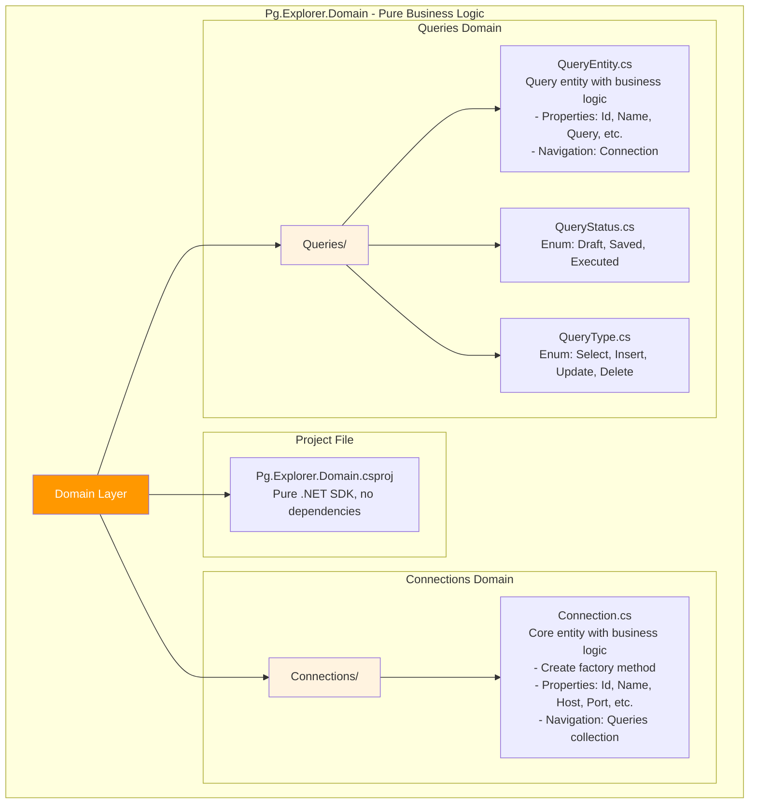

### 4. Infrastructure Layer (External Concerns)

**Project**: `Pg.Explorer.Infrastructure`
**Purpose**: Handles external dependencies and data persistence

This layer manages:

- **Database Context**: Entity Framework Core setup
- **Repository Implementations**: Concrete implementations of feature-defined interfaces
- **External Service Integrations**: Third-party API clients
- **Data Migrations**: Database schema evolution
- **Seeding**: Initial data setup
- **Feature Services**: Infrastructure-level implementations of feature services

**Infrastructure Layer Structure**:

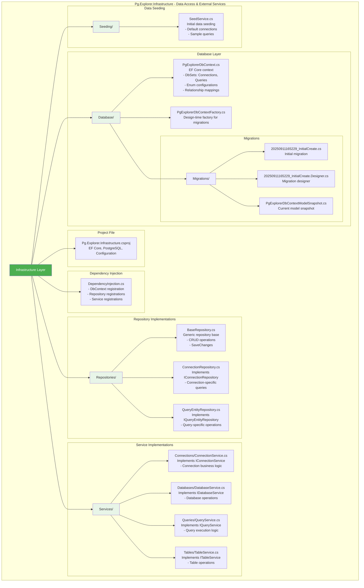

### 5. Shared Layer (Cross-Cutting Concerns)

**Project**: `Pg.Explorer.Shared`
**Purpose**: Common utilities and cross-cutting concerns

Our custom addition to the traditional clean architecture, this layer provides:

- **Encryption Services**: Password encryption/decryption
- **Middleware**: Global exception handling, CORS
- **Pagination**: Common pagination utilities
- **Endpoint Abstractions**: Base interfaces for API endpoints
- **Base Repositories**: Common repository patterns
- **Extensions**: Utility extension methods

**Shared Layer Structure**:

```mermaid
graph TD
    subgraph "Pg.Explorer.Shared - Utilities & Cross-Cutting Concerns"
        SHARED[Shared Layer]
        
        subgraph "Project File"
            SHAREDPROJ[Pg.Explorer.Shared.csproj<br/>ErrorOr, Cryptography, ASP.NET Core]
        end
        
        subgraph "Dependency Injection"
            SHARED_DI[DependencyInjection.cs<br/>- CORS configuration<br/>- Encryption service<br/>- Global exception middleware]
        end
        
        subgraph "Encryption Services"
            ENCRYPT[Encryptions/]
            ENCRYPT --> ENCRYPTSERV[EncryptionService.cs<br/>Password encryption/decryption<br/>- EncryptPassword()<br/>- DecryptPassword()]
            ENCRYPT --> IENCRYPT[IEncryptionService.cs<br/>Encryption interface]
        end
        
        subgraph "Endpoint Abstractions"
            ENDPOINTS[Endpoints/]
            ENDPOINTS --> ABSTR[Abstractions/IEndpoint.cs<br/>Base endpoint interface<br/>- MapEndpoint() method]
            ENDPOINTS --> EXT1[Extensions/EndpointResultsExtensions.cs<br/>Result extension methods<br/>- ToProblem() conversions]
            ENDPOINTS --> EXT2[Extensions/MapEndpointExtensions.cs<br/>Endpoint mapping extensions<br/>- MapEndpoints() registration]
        end
        
        subgraph "Middleware"
            MIDDLEWARE[Middlewares/]
            MIDDLEWARE --> EXCEPTION[GlobalExceptionHandlingMiddleware.cs<br/>Global exception handling<br/>- Error logging<br/>- Response formatting]
        end
        
        subgraph "Pagination Utilities"
            PAGINATION[Pagination/]
            PAGINATION --> PAGEREQ[PageRequest.cs<br/>Pagination request model<br/>- Page, Size, Sort properties]
            PAGINATION --> PAGERESULT[PageResult.cs<br/>Pagination result model<br/>- Data, Total, Page info]
            PAGINATION --> QUERYABLEEXT[QueryableExtensions.cs<br/>LINQ pagination extensions<br/>- ToPagedResult() method]
        end
    end
    
    SHARED --> SHAREDPROJ
    SHARED --> SHARED_DI
    SHARED --> ENCRYPT
    SHARED --> ENDPOINTS
    SHARED --> MIDDLEWARE
    SHARED --> PAGINATION
    
    style SHARED fill:#e91e63,color:#fff
    style ENCRYPT fill:#fce4ec
    style ENDPOINTS fill:#fce4ec
    style MIDDLEWARE fill:#fce4ec
    style PAGINATION fill:#fce4ec
```

### 6. Frontend Layer (Angular Application)

**Project**: `pg-explorer-client`
**Purpose**: Angular 17+ application with SSR support

The Frontend layer provides:

- **Angular Application**: Modern Angular with standalone components
- **Server-Side Rendering**: SSR support for better performance
- **Docker Support**: Containerized deployment
- **API Integration**: HTTP client for backend communication

**Frontend Layer Structure**:

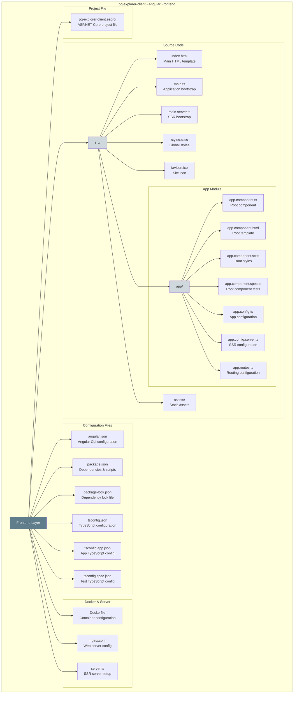

### 7. Test Layers

**Projects**: `Pg.Explorer.Unit.Tests`, `PgExplorer.Integration.Tests`
**Purpose**: Comprehensive testing strategy

The Test layers provide:

- **Unit Tests**: Isolated component testing with xUnit
- **Integration Tests**: End-to-end testing scenarios
- **Test Infrastructure**: Shared testing utilities and configurations

**Test Layers Structure**:

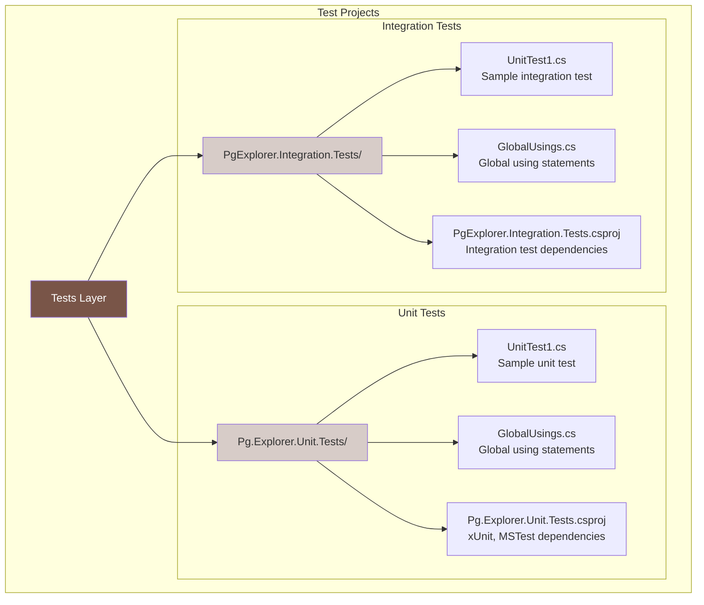

## Architectural Diagrams

### Overall Architecture Flow

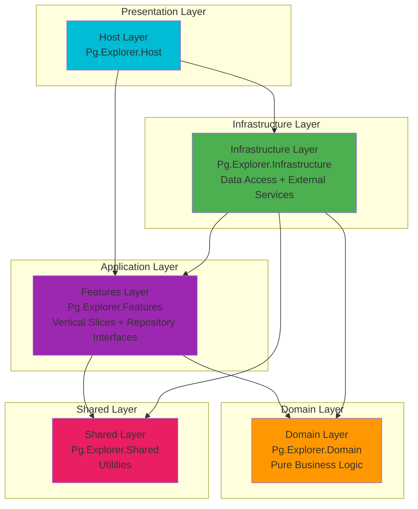

### Vertical Slice Structure with Repository Interfaces

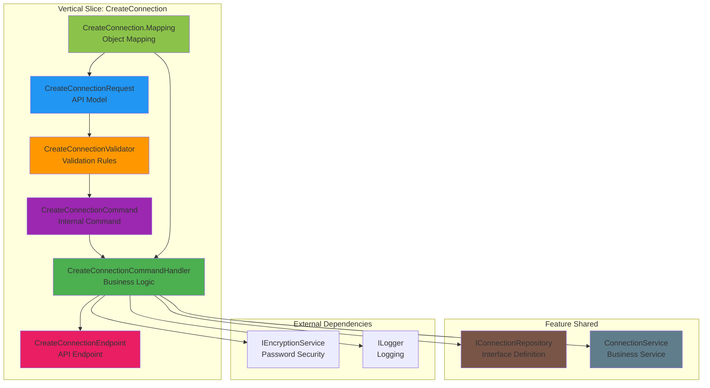

### Feature Organization with Repository Interfaces

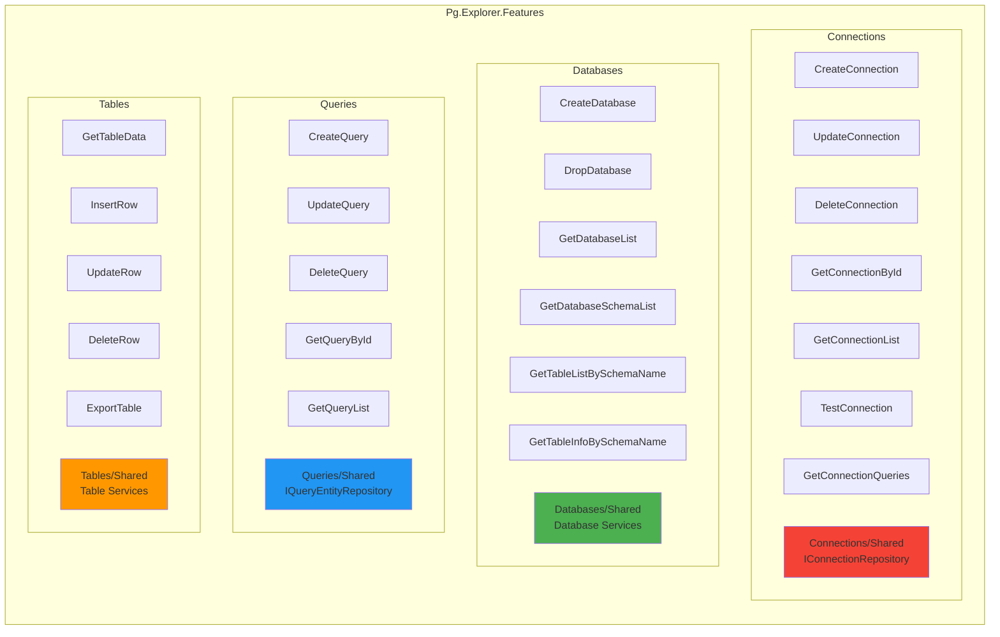

### Dependency Flow with Feature-Driven Repositories

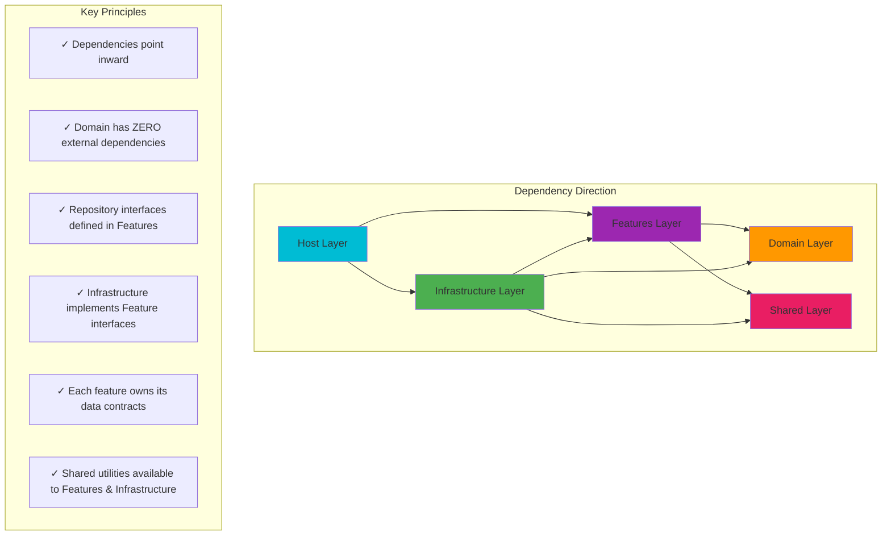

### Repository Interface Flow

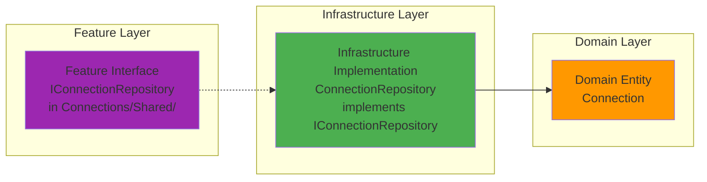

## Key Architectural Principles

### 1. Feature-Driven Repository Pattern

- **Repository interfaces are defined within each feature's Shared folder**
- **Each vertical slice owns its data access contracts**
- **Infrastructure layer implements interfaces defined by features**
- **Complete feature encapsulation** including data access contracts

### 2. Enhanced Vertical Slice Architecture Benefits

- **High Cohesion**: All related code for a feature lives together, including data contracts
- **Low Coupling**: Features don't depend on each other
- **Easy Navigation**: Developers can find all code for a feature in one place
- **Independent Development**: Teams can work on different features simultaneously
- **Simplified Testing**: Each slice can be tested in isolation with its own repository contracts

### 3. Pure Domain Layer Benefits

- **Zero External Dependencies**: Domain layer has absolutely no references to other projects
- **Pure Business Logic**: Only contains domain entities and business rules
- **Framework Independence**: No coupling to any external frameworks
- **Easy Testing**: Pure functions and entities are trivial to test

### 4. Clean Architecture Benefits

- **Testability**: Business logic is isolated and easily testable
- **Independence**: Framework and database are external concerns
- **Flexibility**: Easy to change external dependencies without affecting business logic
- **Maintainability**: Clear separation of concerns makes code easier to understand

### 5. Shared Layer Benefits

- **Code Reuse**: Common utilities prevent duplication
- **Consistency**: Standardized approaches across features
- **Centralized Configuration**: Cross-cutting concerns in one place
- **Easy Updates**: Changes to utilities benefit all features

## Technology Stack

### Backend Technologies

- **.NET 8**: Latest LTS version of .NET
- **ASP.NET Core**: Web API framework
- **Entity Framework Core**: ORM for data access (available in Features layer)
- **PostgreSQL**: Primary database
- **MediatR**: Mediator pattern for CQRS
- **FluentValidation**: Input validation
- **ErrorOr**: Functional error handling

### Frontend Technologies

- **Angular 17+**: Modern Angular with standalone components
- **TypeScript**: Type-safe JavaScript
- **Angular Universal**: Server-side rendering support
- **RxJS**: Reactive programming
- **Angular Material**: UI component library (if used)

### Testing Technologies

- **xUnit**: Unit testing framework
- **MSTest**: Alternative testing framework
- **Moq**: Mocking framework
- **Testcontainers**: Integration testing with real databases

### DevOps & Infrastructure

- **Docker**: Containerization
- **Docker Compose**: Multi-container orchestration
- **Nginx**: Web server for frontend
- **PostgreSQL**: Database server

### Architectural Patterns

- **CQRS**: Command Query Responsibility Segregation
- **Mediator Pattern**: Decoupled request/response handling
- **Feature-Driven Repository Pattern**: Repository interfaces defined within features
- **Dependency Injection**: IoC container for loose coupling
- **Vertical Slice Architecture**: Feature-based organization with embedded contracts
- **Server-Side Rendering**: Angular Universal for better performance

## Development Workflow

### Adding a New Feature

1. **Create Feature Folder**: Add new folder under `Pg.Explorer.Features`
2. **Define Repository Interface**: Create repository interface in `FeatureName/Shared/`
3. **Define Contracts**: Create request/response models
4. **Implement Handler**: Business logic with MediatR
5. **Add Validation**: FluentValidation rules
6. **Create Endpoint**: REST API endpoint
7. **Add Mapping**: Object transformation logic
8. **Register Services**: Update DependencyInjection.cs
9. **Implement Repository**: Create implementation in Infrastructure layer

### Example: Adding a New Feature

```csharp
// 1. Create feature folder: Features/NewFeature/
// 2. Define repository interface in NewFeature/Shared/
public interface INewFeatureRepository : IRepository<NewFeatureEntity, Guid>
{
    // Feature-specific methods
}

// 3. Define request model
public sealed record NewFeatureRequest(string Name, string Description);

// 4. Create command and handler
internal sealed record NewFeatureCommand(string Name, string Description) 
    : IRequest<ErrorOr<NewFeatureResponse>>;

internal sealed class NewFeatureCommandHandler : IRequestHandler<NewFeatureCommand, ErrorOr<NewFeatureResponse>>
{
    private readonly INewFeatureRepository _repository;
    
    public NewFeatureCommandHandler(INewFeatureRepository repository)
    {
        _repository = repository;
    }
    
    // Implementation
}

// 5. Add endpoint
public class NewFeatureEndpoint : IEndpoint
{
    public void MapEndpoint(WebApplication app)
    {
        app.MapPost("/api/new-feature", Handle);
    }
}

// 6. Implement repository in Infrastructure layer
public class NewFeatureRepository : BaseRepository<NewFeatureEntity, Guid>, INewFeatureRepository
{
    // Implementation
}
```

## Benefits of This Architecture

### For Developers

- **Clear Structure**: Easy to understand where code belongs
- **Fast Development**: All feature code is co-located, including data contracts
- **Easy Testing**: Isolated components are simple to test
- **Scalable**: New features don't affect existing ones
- **Feature Ownership**: Each feature owns its complete contract

### For the Business

- **Maintainable**: Changes are localized and predictable
- **Flexible**: Easy to modify or extend functionality
- **Reliable**: Separation of concerns reduces bugs
- **Cost-Effective**: Faster development and easier maintenance
- **Team Productivity**: Features can be developed independently

## Architectural Innovations

### 1. Feature-Driven Repository Pattern

Unlike traditional Clean Architecture where repository interfaces are in the Domain layer, our approach places them
within each feature's Shared folder. This provides:

- **Complete Feature Encapsulation**: Each feature owns its data access contracts
- **Better Cohesion**: Repository interfaces are co-located with the features that use them
- **Easier Refactoring**: Changes to a feature's data needs don't affect other features

### 2. Pure Domain Layer

Our Domain layer has absolutely zero external dependencies, making it the purest possible implementation of
domain-driven design:

- **Framework Independence**: No coupling to Entity Framework, MediatR, or any external library
- **Business Logic Focus**: Contains only entities and pure business logic
- **Easy Testing**: Pure functions and entities are trivial to unit test

### 3. Infrastructure → Features Dependency

This reverse dependency (Infrastructure references Features) might seem unconventional, but it provides:

- **Feature Ownership**: Features define their own data access contracts
- **Implementation Flexibility**: Infrastructure can implement feature contracts in multiple ways
- **Better Testability**: Features can define mock-friendly interfaces

### 4. Full-Stack Architecture

Our architecture spans both backend and frontend with:

- **Consistent Patterns**: Similar organizational principles across layers
- **Independent Deployment**: Frontend and backend can be deployed separately
- **Technology Diversity**: .NET backend with Angular frontend
- **Containerization**: Both layers are Docker-ready

This architecture strikes the perfect balance between structure, flexibility, and developer productivity, making
PgExplorer a robust and maintainable full-stack application that can grow with your needs while maintaining clean
architectural principles.