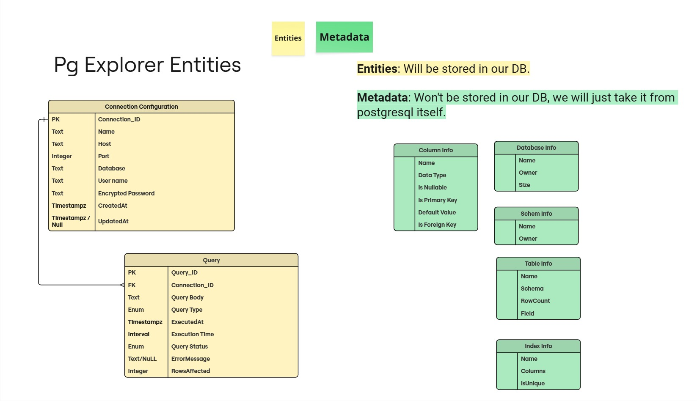

# Pg Explorer Entities

Entities are what **we store** in our own database.  
Metadata is information we **read directly from PostgreSQL**, not stored by us.

---

## 📦 Entities (Stored in our DB)

### Connection Configuration
- **Connection_ID** (PK)
- Name
- Host
- Port
- Database
- User name
- Encrypted password
- CreatedAt (timestamp)
- UpdatedAt (timestamp, nullable)

### Query
- **Query_ID** (PK)
- **Connection_ID** (FK → Connections)
- Query body (text)
- Query type (enum)
- ExecutedAt (timestamp)
- Execution time (timestamp)
- Query status (enum)
- Error message (nullable text)
- Rows affected (integer)

---

## 🗂️ Metadata (Fetched from PostgreSQL, not stored)

### Column Info
- Name
- Data type
- Nullable
- Primary key
- Default value
- Foreign key

### Database Info
- Name
- Owner
- Size

### Schema Info
- Name
- Owner

### Table Info
- Name
- Schema
- Row count
- Fields

### Index Info
- Name
- Columns
- Is unique  

