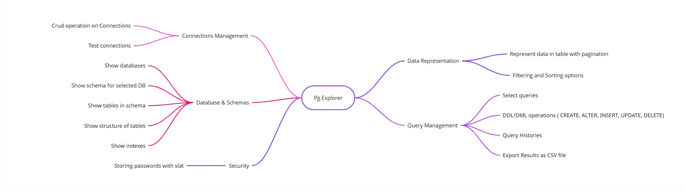

# Pg Explorer – Feature Overview

Pg Explorer is a tool for managing PostgreSQL databases with a focus on connections, schemas, queries, and data representation.

## 🔌 Connections Management
- Create, read, update, delete (CRUD) operations on connections
- Test connections

## 🗂️ Database & Schemas
- Show databases
- Show schema for a selected database
- Show tables in a schema
- Show structure of tables
- Show indexes

## 🔐 Security
- Store passwords with salt

## 📊 Data Representation
- Represent data in tables with pagination
- Filtering and sorting options

## 📝 Query Management
- Run `SELECT` queries
- Run DDL/DML operations (`CREATE`, `ALTER`, `INSERT`, `UPDATE`, `DELETE`)
- View query history
- Export results as CSV file  

